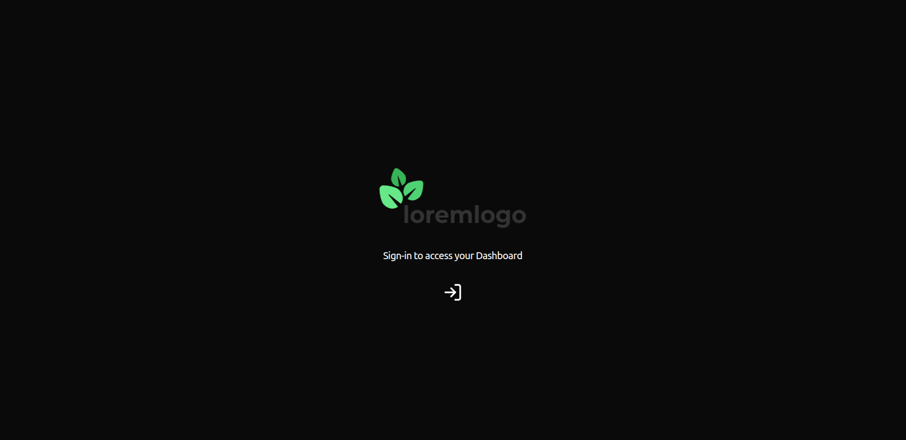
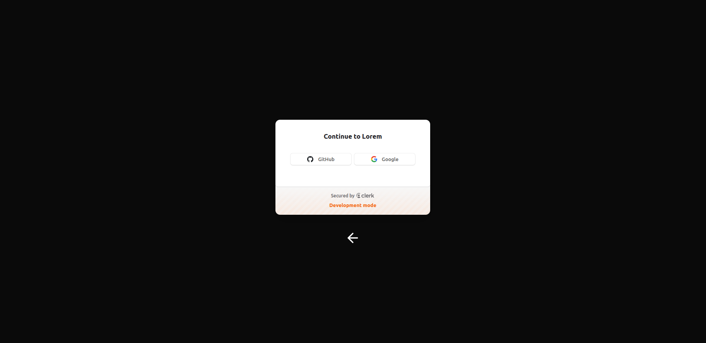
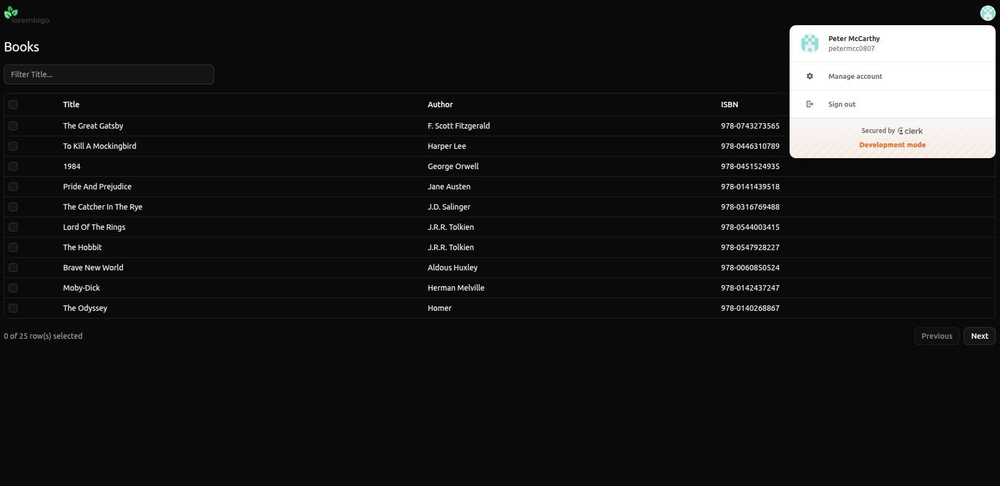

# njsgql-web-app
The `njsgql-web-app` project implements a simple frontend, as a Next.js (React) web app, that queries a backend API and displays a collection of books.

## Hosting
The frontend is hosted in [Vercel](https://njsgql-web-app.vercel.app/).

The frontend's authentication and user management services are hosted by [Clerk](https://clerk.com/user-authentication).

The frontend utilises [Apollo Client](https://www.apollographql.com/docs/react) to query a GraphQL backend API.

## Packages
The following packages are used:

* `shadcn` (React UI components)

* `@tanstack/react-table` (React data table UI component)

* `lucide-react` (React icons)

* `@apollo/client` (Apollo GraphQL client)

## Usage
To use the frontend, perform the following steps:

* Visit the [Home](https://njsgql-web-app.vercel.app/) page

* Sign-in with a GitHub or Google account to access the Dashboard page where books will be listed

## Screenshots
### Home

### Sign In

### Dashboard

